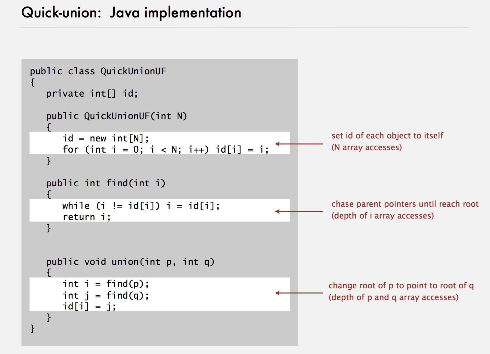
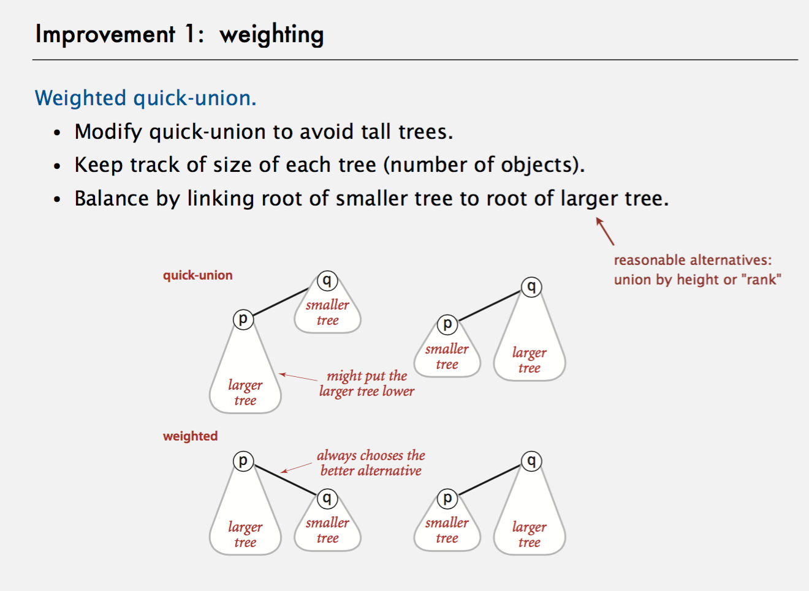

##Union Find

###Better Solution
- just change the root of p to q, not every element to q

###Still two ways to better to improve
#### 1: Weighted quick-union

#### 2: Path Compression

####Summary

