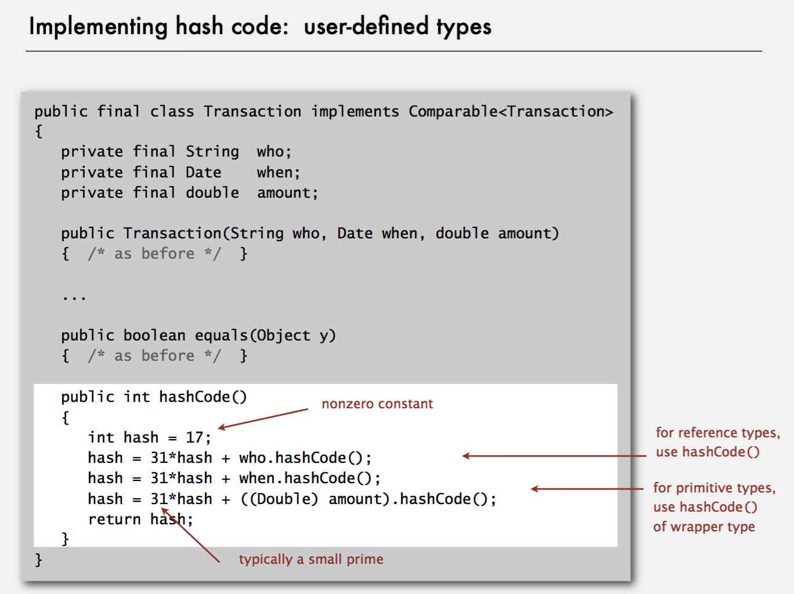
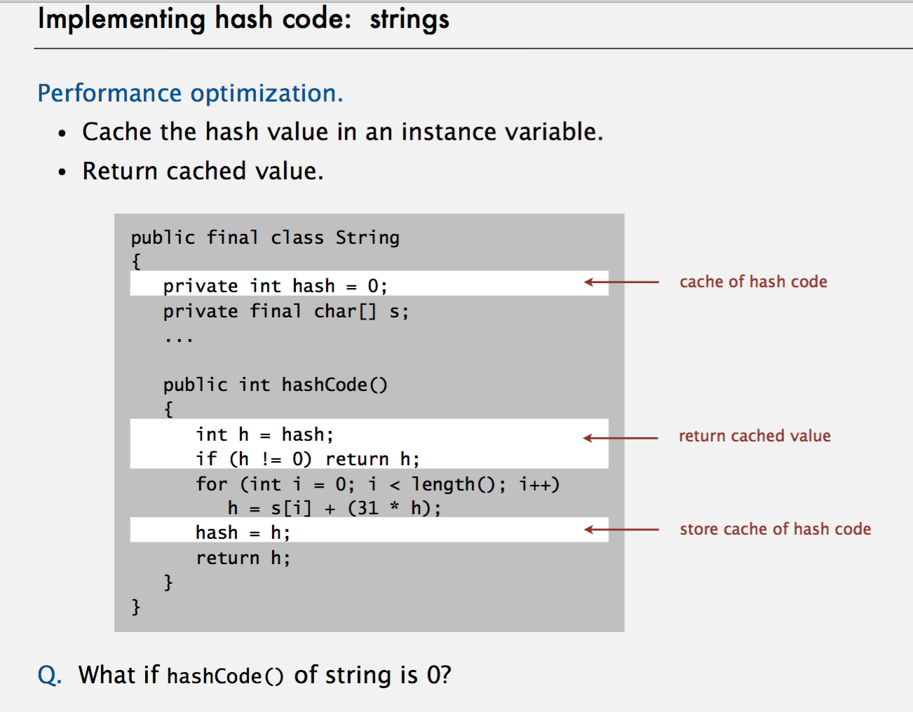

# Map - 哈希表

Map 是一种关联数组的数据结构，也常被称为字典或键值对。

####User Define Hash

####String Hash

####Chaining Hash


## 编程实现

###Map
Map用于存储具有映射关系的数据。Map中存了两组数据(key与value),它们都可以是任何引用类型的数据，key不能重复，我们可以通过key取到对应的value。Map的实现类在面试中常用是：HashMap 和 TreeMap.

####HashMap与TreeMap
- key 无重复，value 允许重复
- 允许 key 和 value 为空
- 数据无序
```java
public class Solution {
    public static void main(String[] args){
        Map<String, String> map = new HashMap<>();
        for (int i = 5; i > 0; i --) {
            map.put(i + "", i + "");
        }
        map.put("1","1");//key无重复
        map.put("11","1");//value可以重复
        map.put(null, null);//可以为空
        for (Iterator i = map.keySet().iterator(); i.hasNext(); ) {
            String key = (String)i.next();
            String value = map.get(key);
            System.out.println("key = " + key + ", value = " + value);
        }
    }
}
//输出
/*
key = 11, value = 1
key = null, value = null
key = 1, value = 1
key = 2, value = 2
key = 3, value = 3
key = 4, value = 4
key = 5, value = 5
*/
//输出顺序与输入顺序无关
```
####TreeMap
- key 无重复，value 允许重复
- 不允许有null
- 有序(存入元素的时候对元素进行自动排序，迭代输出的时候就按排序顺序输出)
```java
public class Solution {
    public static void main(String[] args){
        Map<String, String> map = new TreeMap<>();
        for (int i = 5; i > 0; i --) {
            map.put(i + "", i + "");
        }
        map.put("1","1");//key无重复
        map.put("11","1");//value可以重复
        //map.put(null, null);//不可以为空
        for (Iterator i = map.keySet().iterator(); i.hasNext(); ) {
            String key = (String)i.next();
            String value = map.get(key);
            System.out.println("key = " + key + ", value = " + value);
        }
    }
}
//输出
/*
key = 1, value = 1
key = 11, value = 1
key = 2, value = 2
key = 3, value = 3
key = 4, value = 4
key = 5, value = 5
*/
//输出顺序位String排序后的顺序
```

### Java

Java 的实现中 Map 是一种将对象与对象相关联的设计。常用的实现有`HashMap`和`TreeMap`, `HashMap`被用来快速访问，而`TreeMap`则保证『键』始终有序。Map 可以返回键的 Set, 值的 Collection, 键值对的 Set.

- 可以读取entrySet()得到所有的key
- 可以读取values()得到所有的value

```java
Map<String, Integer> map = new HashMap<String, Integer>();
map.put("bill", 98);
map.put("ryan", 99);
boolean exist = map.containsKey("ryan"); // check key exists in map
int point = map.get("bill"); // get value by key
int point = map.remove("bill") // remove by key, return value
Set<String> set = map.keySet();
// iterate Map
// 这个用法很棒
for (Map.Entry<String, Integer> entry : map.entrySet()) {
    String key = entry.getKey();
    int value = entry.getValue();
    // do some thing
}
```
