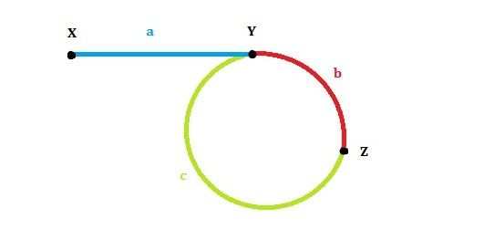

##Linked List Cycle II

36% Accepted

	Given a linked list, return the node where the cycle begins.
    If there is no cycle, return null.

	Have you met this question in a real interview? Yes
	Example
	Given -21->10->4->5, tail connects to node index 1，返回10

####Challenge
- Can you solve it without using extra space?

####Tags Expand
- Two Pointers
- Linked List


####思路
- [参考资料](http://www.cnblogs.com/hiddenfox/p/3408931.html)
- 
- 链表头是X，环的第一个节点是Y，slow和fast第一次的交点是Z。各段的长度分别是a,b,c，如图所示。环的长度是L。slow和fast的速度分别是qs,qf
- 第一次相遇时slow走过的距离：a+b，fast走过的距离：a+b+c+b。因为fast的速度是slow的两倍，所以fast走的距离是slow的两倍，有 2(a+b) = a+b+c+b，可以得到a=c（这个结论很重要！）。我们发现L=b+c=a+b，也就是说，从一开始到二者第一次相遇，循环的次数就等于环的长度。
- 当我们得到相交的点的时候，让slow回到dummy(dummy.next = head)，重新来走一遍，这样当slow = slow.next fast = fast.next,他们相交的时候，这个点就是环的入口

```java
/**
 * Definition for singly-linked list.
 * class ListNode {
 *     int val;
 *     ListNode next;
 *     ListNode(int x) {
 *         val = x;
 *         next = null;
 *     }
 * }
 */
public class Solution {
    public ListNode detectCycle(ListNode head) {
        if (head == null) {
            return null;
        }

        ListNode fast = head;
        ListNode slow = head;

        while (fast != null && fast.next != null) {
            fast = fast.next.next;
            slow = slow.next;
            if (fast == slow) {
                break;
            }
        }

        if (fast == null || fast.next == null) {
            return null;
        }

        slow = head;

        while (slow != fast) {
            slow = slow.next;
            fast = fast.next;
        }

        return slow;
    }
}
```
